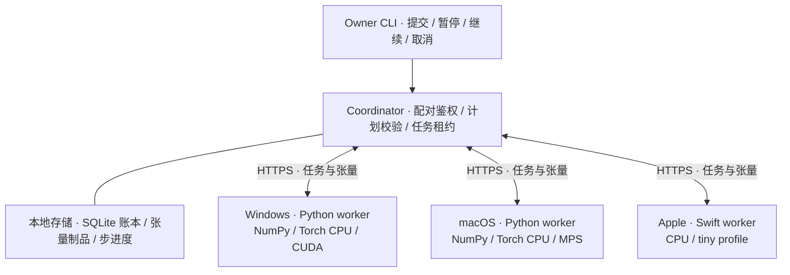

<h1 align="center">HeteroMesh</h1>

<p align="center">
  <strong>让分散的设备，共同承载一个模型。</strong><br />
  Heterogeneous inference across everyday devices.
</p>

<p align="center">
  <a href="#项目状态"></a>
  <a href="pyproject.toml"></a>
  <a href="https://github.com/tuzhechen2005/heteromesh/actions/workflows/python.yml"></a>
  <a href="https://github.com/tuzhechen2005/heteromesh/actions/workflows/apple.yml"></a>
</p>

<p align="center">
  <a href="#快速开始">快速开始</a> ·
  <a href="#工作原理">工作原理</a> ·
  <a href="#平台与模型">平台与模型</a> ·
  <a href="#路线图">路线图</a> ·
  <a href="#文档导航">文档</a> ·
  <a href="#参与贡献">参与贡献</a>
</p>

---

HeteroMesh 探索如何让 Windows PC、Apple Silicon Mac 与 iPhone 通过局域网执行**同一个模型的不同计算片段**，利用分散的内存和计算资源，扩大单次推理可承载的模型容量。首个目标工作负载是完全本地的视频生成，首个目标模型是 **MiniMax H3**。

目前已实现受控任务协议、真实小 Transformer 接力、Swift 计算节点，以及 H3 Transformer 分段与选定权重加载。适合研究异构推理、协议互操作与模型分片的开发者参与。

> **Experimental · 项目仍处于开发与验证阶段。**
> 当前可运行入口是小 Transformer 示例。官方完整 H3 权重、Windows–Mac 物理设备协作、iPhone 真机计算与完整视频生成均未验收。CI 徽章表示软件检查状态，硬件证据见下方矩阵。

## 为什么做 HeteroMesh

一台 PC 的显存、一台 Mac 的统一内存和手机的计算资源，通常彼此孤立。HeteroMesh 的目标是让这些设备在同一次推理中各自承担有贡献的计算，使手边的设备能够共同承载更大的模型。

这一目标同时要求模型切分、跨后端数值一致性、资源预算与可靠执行。项目围绕以下原则构建：

| 原则 | 工程实现与约束 |
| --- | --- |
| **真实计算贡献** | 小模型输出依赖各指定节点执行的连续 block；目标验收要求每台物理设备参与最终模型计算。 |
| **显式资源预算** | 按权重、激活、工作区、传输缓冲与余量检查放置；Apple 统一内存只计一次。 |
| **可解释的失败** | 不支持的后端、算子或不足的资源明确拒绝；远端任务不会静默转到协调器执行。 |
| **受控协议** | 配对鉴权、证书指纹校验、版本化 JSON 与有界二进制张量；节点只执行本地注册的算子。 |
| **可核验的进度** | 作业账本记录任务、尝试与恢复 epoch；小模型支持步边界暂停、继续和取消。 |
| **本地优先** | 完整目标是在预装权重后仅通过局域网完成推理；目标视频的断网验收仍待执行。 |

多设备分片会增加通信与同步成本。**容量扩展是项目目标，速度提升需要实测**；当前没有发布跨物理设备的性能或容量收益基准。

## 项目状态

“实现了什么”和“在哪种环境验证过”分别记录。下表概括已合入代码的能力与证据；历史测试结果对应各证据文件中的提交和环境。

| 能力 | 软件进展 | 已记录的验证范围 |
| --- | --- | --- |
| 配对、张量协议与资源预算 | 已实现 | Python/Swift 共享字节 fixtures、安全与预算检查；[协议证据](docs/testing/evidence/protocol-capacity.md) |
| 小 Transformer 接力 | 已实现 | 真实 HTTPS、多进程任务；同一 Mac 上 NumPy/MPS 接力；[CLI 证据](docs/testing/evidence/cli.md) |
| Swift worker 与前台 iOS App | 原型已实现 | 同一 Mac 上 Python/Swift 实际计算与 TLS；CI 编译模拟器 App；[Apple 说明](docs/development/apple.md) |
| H3 Transformer 前段、主 blocks、后段与双 scheduler 更新 | 组件实现 | 固定上游算子、缩小配置、自有权重、CPU 数值验证；[结构测试证据](docs/testing/evidence/h3-fullgraph.md) |
| 选定 safetensors 权重加载 | 已实现 | 自有文件、选定 tensor、显式加载预算；[加载器证据](docs/testing/evidence/weight-loader.md) |
| 开发 wheel / sdist | 已实现 | 构建、校验与干净环境安装检查；[制品证据](docs/testing/evidence/development-artifacts.md) |
| Windows + Mac 物理设备协作 | 待验证 | **NOT RUN** |
| 两台 iPhone 对同一次推理作出计算贡献 | 待验证 | **NOT RUN** |
| 官方 H3 权重与完整离线视频生成 | 待完成 | **NOT RUN** |
| 相同配置下单节点与集群容量对照 | 待验证 | **NOT RUN** |

同机多进程验证属于基础设施证据；真实物理设备协作与目标模型验收单独记录。最新整合范围见[已合入增量与恢复入口](docs/development/pause-recovery.md)，完整验收要求见[测试计划](docs/testing/test-plan.md)。

## 快速开始

### 1. 安装开发版

需要 **Python 3.11+**（CI 使用 3.12）、Git，以及协调节点可调用的 `openssl`。目前从源码安装。

以下示例使用 macOS / Linux shell：

```bash
git clone https://github.com/tuzhechen2005/heteromesh.git
cd heteromesh
python3.12 -m venv .venv
source .venv/bin/activate
python -m pip install -e .
python -m heteromesh --help
```

Windows PowerShell 使用 `py -3.12 -m venv .venv` 创建环境、`.venv\Scripts\Activate.ps1` 激活；后续双机接入步骤见 [Mac / Windows 指南](docs/development/quickstart.md)。

基础安装使用 NumPy，**无需下载模型权重或安装 PyTorch**。示例使用仓库自有的确定性小模型输入与真实 Transformer 运算。

### 2. 启动本机协调器

在终端 A 中运行，保持进程前台运行：

```bash
python -m heteromesh coordinator --host 127.0.0.1 --port 7443
```

默认数据目录为 `~/.heteromesh/coordinator`。在另一终端激活同一虚拟环境，为两个 worker 分别创建邀请：

```bash
python -m heteromesh pair --out ~/.heteromesh/pair-a.json
python -m heteromesh pair --out ~/.heteromesh/pair-b.json
```

邀请五分钟内有效、仅可使用一次。邀请和节点配置含私密凭据，应保存在用户私有目录；文件已存在时命令会拒绝覆盖，请使用新的文件名。

### 3. 启动两个计算节点

在终端 B 中激活虚拟环境后运行：

```bash
python -m heteromesh join --pairing-file ~/.heteromesh/pair-a.json --config ~/.heteromesh/node-a.json --backend numpy
python -m heteromesh worker --config ~/.heteromesh/node-a.json
```

在终端 C 中激活虚拟环境后运行：

```bash
python -m heteromesh join --pairing-file ~/.heteromesh/pair-b.json --config ~/.heteromesh/node-b.json --backend numpy
python -m heteromesh worker --config ~/.heteromesh/node-b.json
```

两个 worker 保持运行，分别执行同一小模型的依赖片段。这是**单机、多进程**示例。

### 4. 提交任务并验证实际输出

在终端 D 中激活虚拟环境，列出节点，将占位符替换为实际返回的 ID：

```bash
python -m heteromesh nodes
python -m heteromesh submit-tiny --nodes <NODE_A_ID> <NODE_B_ID> --steps 2
python -m heteromesh status --job <JOB_ID>
```

任务 ID 来自 `submit-tiny` 的输出。等待 `status` 返回 `state: succeeded` 后执行：

```bash
python -m heteromesh verify-tiny --job <JOB_ID>
```

验证器取回最终张量，与完整 NumPy 参考计算按 `atol=1e-5, rtol=1e-4` 比较。成功输出包含以下字段（摘录）：

```json
{
  "numerical_match": true,
  "profile": "tiny-transformer-v1",
  "h3_validated": false
}
```

当前 tiny profile 接受 **2–8 个不同节点、1–8 个 step**。数值一致表示这次小模型任务通过比较，物理设备身份和运行后端仍需在实验记录中注明。完成后可在协调器与 worker 终端按 `Ctrl+C` 停止进程。

### 接入真实设备与 GPU

按 [Mac / Windows 双机指南](docs/development/quickstart.md)配置局域网地址、可信邀请传递与 TCP 7443 可达性。PyTorch 后端需先安装 `python -m pip install -e '.[torch]'`，再在 `join` 时显式选择：

| `--backend` | 执行路径 | 安装与设备要求 |
| --- | --- | --- |
| `numpy` | CPU / NumPy | 基础安装 |
| `torch-cpu` | CPU / PyTorch | `.[torch]` |
| `mps` | Apple Silicon GPU / PyTorch MPS | `.[torch]` 与可用的 MPS 设备 |
| `cuda` | NVIDIA GPU / PyTorch CUDA | `.[torch]`、兼容驱动与可用的 CUDA 运行时 |

后端不可用时直接失败。Swift CPU 节点及 iOS App 的构建、配对方式和限制见 [Apple 开发说明](docs/development/apple.md)。

## 工作原理

协调器维护会话、执行计划、制品和作业状态，worker 执行本地注册的模型片段。当前小模型通过协调器传递具名张量，按依赖顺序逐段推进。



图中展示软件执行路径；各平台的实测范围见[项目状态](#项目状态)。

1. **建立信任。** Owner 创建一次性邀请；节点校验证书指纹并注册自己的能力与资源预算。
2. **检查放置。** 协调器校验固定 profile、算子、精度、节点状态及逐节点峰值预算，再接纳任务。
3. **执行依赖图。** worker 领取任务、下载授权输入、执行真实算子并上传输出；后续片段引用前序结果。
4. **提交与恢复。** 账本区分任务尝试和恢复 epoch，拒绝过期结果；完整 step 边界可保存进度与暂停。

线上格式以[协议 v1](docs/spec/protocol-v1.md)为准；张量包含名称、形状、dtype、长度与校验。计算代码保留在节点本地，协议不传递 pickle 或远程可执行代码。

当前 CLI 只接入 tiny profile。H3 Transformer 组件尚未接入完整的网络视频作业，H3 模型状态的持久化检查点也仍需完成；任务进度账本与完整模型恢复状态各有独立的验收要求。

## 平台与模型

| 平台 | 已有实现 | 验证边界 |
| --- | --- | --- |
| Linux | Python 协调器与 worker | CPU 软件 CI；本项目未记录 Linux GPU 真机验收 |
| Windows | Python 协调器与 worker，NumPy / Torch CPU / CUDA 入口 | CPU 软件 CI；Windows CUDA 与 Mac 双机实测 **NOT RUN** |
| macOS | Python 协调器与 worker，NumPy / Torch CPU / MPS 入口 | CPU 软件 CI；已记录同一 Mac 上 NumPy/MPS 真实计算 |
| Apple / Swift | 协议库、CPU tiny worker、前台 iOS App 原型 | Mac 跨语言验证与模拟器编译；iPhone 真机 **NOT RUN** |

| 模型 / profile | 当前可用范围 |
| --- | --- |
| `tiny-transformer-v1` | CLI 可提交的固定小模型；attention、LayerNorm、FFN、残差与非零条件输入参与真实计算。 |
| MiniMax H3 | 固定上游结构的 Transformer 分段、双 scheduler 更新与选定权重加载组件；验证使用缩小配置和自有权重。完整文本编码、VAEs、网络作业、真实权重视频生成仍待集成与验收。 |

HeteroMesh 目前采用显式静态分片、顺序单作业执行。自动重分片、任意模型接入和完整集群观测属于后续工作。

## 作业控制与常见问题

以下命令在保存协调器状态的 Owner 环境运行：

```bash
python -m heteromesh status --job <JOB_ID>
python -m heteromesh pause --job <JOB_ID>
python -m heteromesh resume --job <JOB_ID>
python -m heteromesh cancel --job <JOB_ID>
```

`pause` 在完整 step 边界生效。节点掉线后，任务按租约、超时与有限重试规则处理；协调器不会接管远端计算。

<details>
<summary><strong>节点加入或任务执行失败时，先检查什么？</strong></summary>

- **邀请失效或文件已存在：** 每个节点使用独立邀请，在五分钟内加入；重试时创建新的邀请与配置文件名。
- **节点不可达：** 检查协调器绑定地址、节点使用的局域网地址及 TCP 7443。默认 `127.0.0.1` 仅供本机示例；双机流程见[接入指南](docs/development/quickstart.md)。
- **MPS / CUDA 不可用：** 确认安装了对应 PyTorch 运行时，且设备与驱动满足要求；仅需 CPU 时显式选择 `numpy`。
- **任务未成功或资源不足：** 先查看 `status` 与 worker 状态，确认节点仍在线、profile 可执行且预算足够；`verify-tiny` 只验证已成功的任务。

提交 Issue 前，请移除邀请、配置凭据、真实局域网地址、节点标识和私有路径。

</details>

## 路线图

里程碑以可复现的执行证据验收，顺序反映当前依赖关系。

- [x] **协议与执行基础：** 配对、跨语言张量、资源预算、真实 tiny 接力、作业账本与控制入口。
- [x] **H3 组件基础：** 固定上游元数据、Transformer 分段、双 scheduler 更新、选定权重加载的结构验证。
- [ ] **H3 分布式执行：** 接入网络阶段与完整模型检查点，验证加载与运行峰值、故障恢复及数值误差。
- [ ] **真实视频链路：** 完成文本编码、VAEs、受许可约束的正式权重装载与可播放视频导出。
- [ ] **异构物理设备：** Windows CUDA + Mac MPS 的真实协作，以及两台 iPhone 各自执行影响最终结果的模型运算。
- [ ] **容量与离线验收：** 固定精度、分辨率、帧数及卸载策略，证明单节点容量失败、集群成功，并完成屏蔽 WAN 后的生成与恢复验证。

详细需求与完成条件见 [PRD](docs/product/PRD.md)、[系统规格](docs/spec/system-spec.md)和[测试矩阵](docs/testing/test-plan.md)。

## 文档导航

| 想了解什么 | 入口 |
| --- | --- |
| 安装并连接 Mac / Windows | [双机快速开始](docs/development/quickstart.md) · [CLI 契约](docs/spec/local-cli.md) |
| 构建 Swift 节点与 iOS App | [Apple 开发说明](docs/development/apple.md) |
| 理解目标与设计选择 | [产品需求](docs/product/PRD.md) · [可行性研究](docs/research/feasibility.md) · [设计决议](docs/reviews/design-decision.md) |
| 实现兼容的节点或后端 | [系统规格](docs/spec/system-spec.md) · [协议 v1](docs/spec/protocol-v1.md) · [Tiny Transformer](docs/spec/tiny-transformer.md) |
| 研究 H3 模型适配 | [分段适配](docs/spec/h3-adapter.md) · [完整 Transformer 阶段](docs/spec/h3-fullgraph.md) · [权重加载](docs/spec/h3-weight-loader.md) |
| 查看测试与真实证据 | [测试计划](docs/testing/test-plan.md) · [运行时证据](docs/testing/evidence/runtime.md) · [整合记录](docs/development/pause-recovery.md) |
| 参与开发与评审 | [开发流程](docs/development/workflow.md) · [开发制品规范](docs/spec/development-artifacts.md) |

## 参与贡献

欢迎围绕协议互操作、CUDA/MPS/Swift 数值验证、H3 组件集成、资源测量与安装体验提交贡献。可先[查看 Issues](https://github.com/tuzhechen2005/heteromesh/issues)，或[提交问题与实验记录](https://github.com/tuzhechen2005/heteromesh/issues/new)。

开始前阅读[开发流程](docs/development/workflow.md)、对应规格和[测试计划](docs/testing/test-plan.md)：

1. 在独立 `codex/` 分支上修改；并行代码工作使用隔离 worktree。
2. 行为变更先更新规格，给出有意义的 RED/GREEN 测试证据；文档变更检查链接、格式与事实一致性。
3. 提交 PR，记录需求、验证命令、限制及 `Agent-Author`；由非作者 agent 审查精确 head SHA。
4. 最新提交的必需 CI 与 `agent-review` 门禁通过后合并。

共享 GitHub 登录下的 agent 审查属于可审计的流程记录，独立账号的 GitHub 原生 approval 尚不可用；具体规则见[审查流程](docs/development/workflow.md)。

基础开发检查：

```bash
python -m pip install -e '.[test]'
python -m unittest discover -s tests/governance -v
python tools/check_docs.py
python -m pytest -q -rs
```

基础测试不下载模型权重，也不启动长时间 GPU 任务。未安装可选运行时或硬件不可用的测试会报告跳过；额外的 CPU 结构与加载器检查按需安装 `requirements/h3-runtime.txt`、`requirements/weight-loader.txt`，对应环境与命令见[测试计划](docs/testing/test-plan.md)和[证据目录](docs/testing/evidence)。

硬件实验请分别标注模拟、同机多进程、跨物理设备和目标模型证据，并记录提交、profile、数值容差与资源测量。保持凭据和私人设备信息脱敏。

## 许可证与模型权重

本仓库尚未添加项目级 `LICENSE`，代码许可证待维护者明确。

仓库不打包 H3 权重。H3 权重受上游社区许可约束，公开可下载不代表所有地区和用途均获授权；模型部署需核对对应来源、版本和许可。代码、依赖与模型权重的许可应分别记录，详见[可行性研究](docs/research/feasibility.md)。
